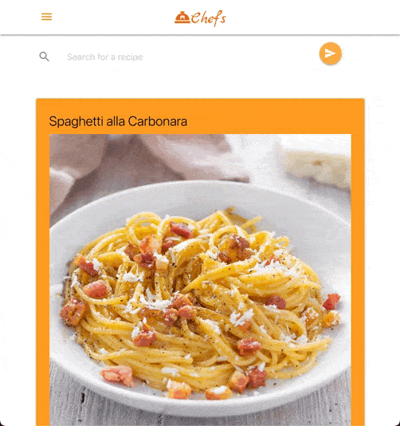
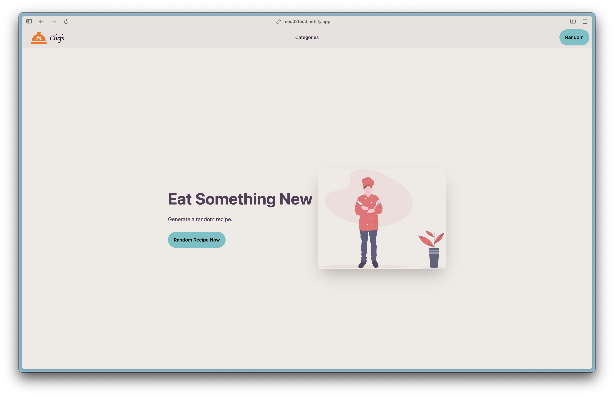
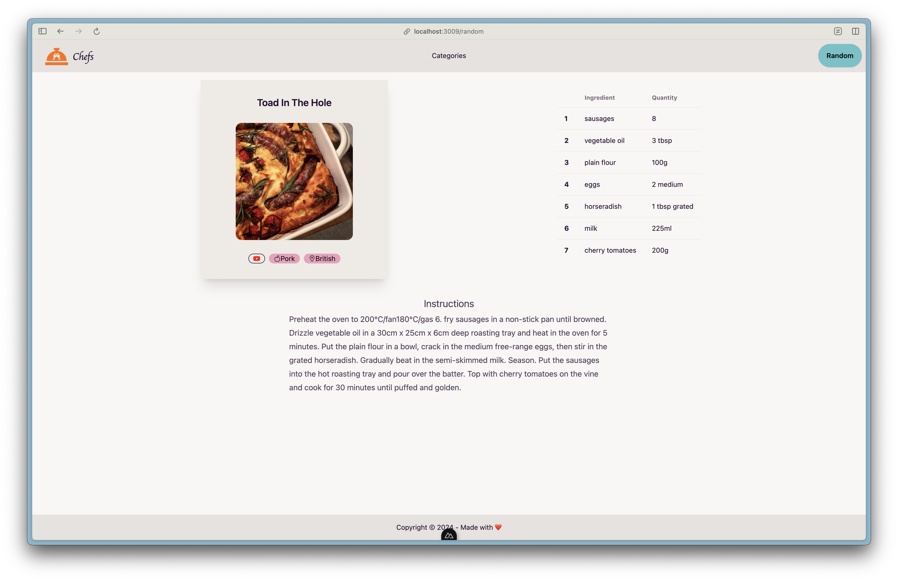

# Chef's Meal Planner

Free meal planner for cooks short on ideas! (like me …)

## Demo

[🚀 App live at this address!](https://mood2food.netlify.app/)

### Screenshots

#### Home page

#### Meal page

## Features

- Random meal suggestion ✓
- Search by name: you look for a recipe? Ours are easy to make and Yummy! ✓
- What's in the fridge ? Choose your main ingredient and get a meal suggestion
- Choose by a category: ✓
  - Beef
  - Breakfast
  - Chicken
  - Dessert
  - Goat
  - Lamb
  - Miscellaneous
  - Pasta
  - Pork
  - Seafood
  - Side
  - Starter
  - Vegan
  - Vegetarian
- Choose by area:
  - American
  - British
  - Canadian
  - Chinese
  - Dutch
  - Egyptian
  - French
  - Greek
  - Indian
  - Irish
  - Italian
  - Jamaican
  - Japanese
  - Kenyan
  - Malaysian
  - Mexican
  - Moroccan
  - Russian
  - Spanish
  - Thai
  - Tunisian
  - Turkish
  - Unknown
  - Vietnamese
- Cocktail selection
- Create a profile and save your favourite meals ✓
- Notation system: know what are the most loved meals
- Share recipe with your friends and family
- Suggestions based on what your personal taste
- Recipes in Video ✓
- Get a full menu (Starter, Main, Dessert + Cocktail)
- Send a daily suggestion to newsletter
- History
- Language selection
- Nutritive value
- Add personal notes

## Supports

- Web ✓
- Progressive Web App ✓
- Mobile

## Deployment

The application is hosted on [Netlify](https://netlify.com/) at the following
address: [link](https://mood2food.netlify.app/).

## Built With

- [Nuxt](https://nuxt.com/) - The Intuitive Vue Framework
- [Tailwindcss](https://tailwindcss.com) -Rapidly build modern websites without
  ever leaving your HTML.
- [TheMealDb](https://www.themealdb.com/api.php) - An open, crowd-sourced database
  of Recipes from around the world

## Contributing

Please read [CONTRIBUTING.md](https://github.com/rjNemo/meal_planner/contributors)
for details on our code of conduct, and the process for submitting pull requests
to us.

## Versioning

We use [SemVer](http://semver.org/) for versioning. For the versions available, see
the [tags on this repository](https://github.com/rjNemo/meal_planner/tags).

## Authors

- **Ruidy Nemausat** - _Initial work_ - [GitHub](https://github.com/rjNemo)

See also the list of [contributors](https://github.com/rjNemo/meal_planner/contributors)
who participated in this project.

## License

This project is licensed under the MIT License - see the [LICENSE.md](LICENSE.md)
file for details
