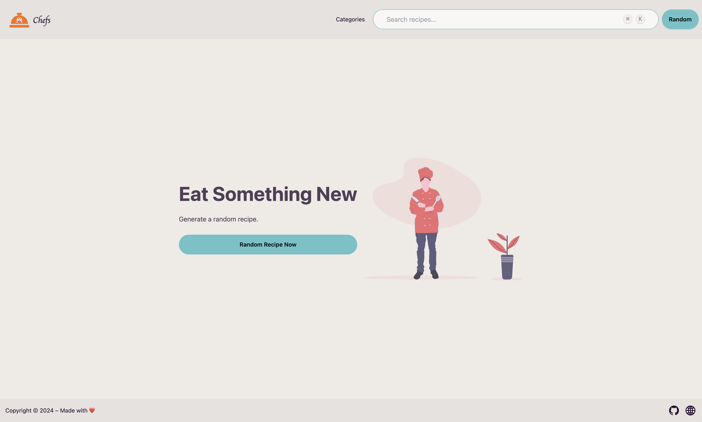
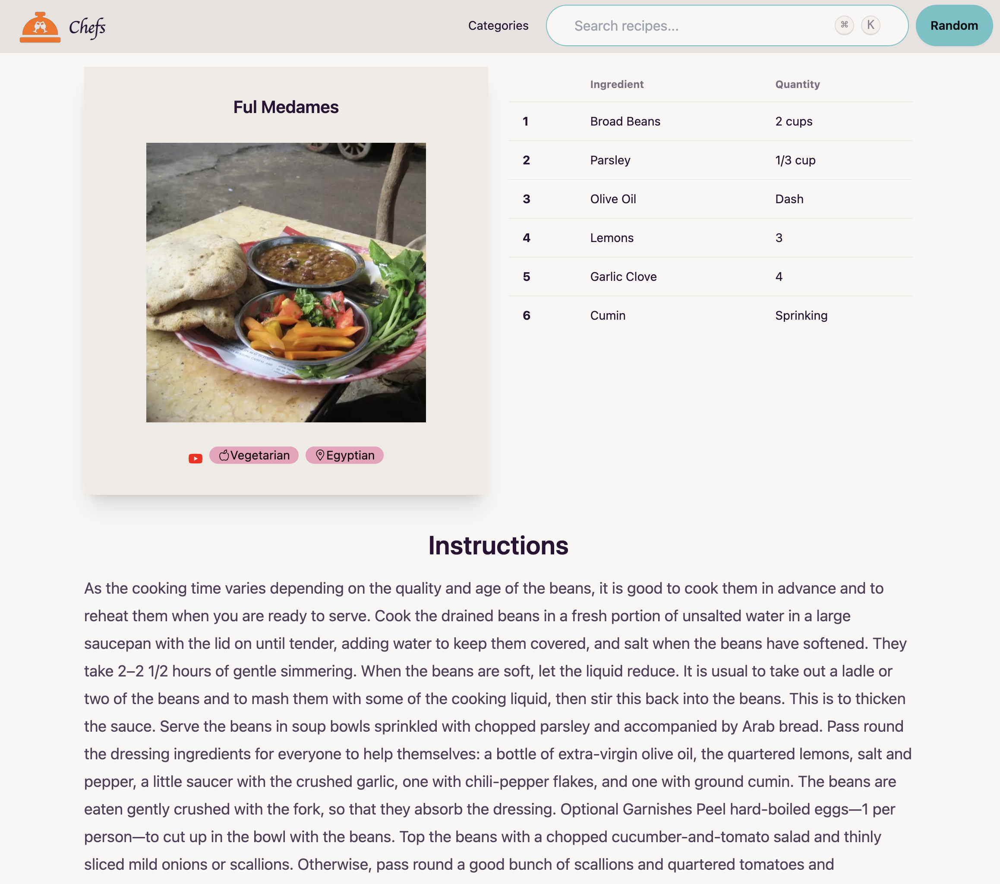

# Chef's Meal Planner

Free meal planner for cooks short on ideas! (like me …)

## Demo

[🚀 App live at this address!](https://chefs-meal-planner.onrender.com/)

### Screenshots

#### Home page

#### Meal page

## Feature list

- Random meal suggestion ✓
- Search by name: you look for a recipe? Ours are easy to make and Yummy! ✓
- What's in the fridge ? Choose your main ingredient and get a meal suggestion
- Choose by a category: ✓
  - Beef
  - Breakfast
  - Chicken
  - Dessert
  - Goat
  - Lamb
  - Miscellaneous
  - Pasta
  - Pork
  - Seafood
  - Side
  - Starter
  - Vegan
  - Vegetarian
- Choose by area:
  - American
  - British
  - Canadian
  - Chinese
  - Dutch
  - Egyptian
  - French
  - Greek
  - Indian
  - Irish
  - Italian
  - Jamaican
  - Japanese
  - Kenyan
  - Malaysian
  - Mexican
  - Moroccan
  - Russian
  - Spanish
  - Thai
  - Tunisian
  - Turkish
  - Unknown
  - Vietnamese
- Cocktail selection
- Create a profile and save your favourite meals ✓
- Notation system: know what are the most loved meals
- Share recipe with your friends and family
- Suggestions based on what your personal taste
- Recipes in Video ✓
- Get a full menu (Starter, Main, Dessert + Cocktail)
- Send a daily suggestion to newsletter
- History
- Language selection
- Nutritive value
- Add personal notes

## Supports

- Web ✓
- Progressive Web App ✓
- Mobile

## Deployment

The application is hosted on [Render](https://render.com/) at the following address: [link](https://chefs-meal-planner.onrender.com/).

## Built With

- [React](https://reactjs.org/) - A JavaScript library for building user interfaces
- [Materialize](https://materializecss.com) - Modern responsive CSS framework based on Material Design by Google
- [TheMealDb](https://www.themealdb.com/api.php) - An open, crowd-sourced database of Recipes from around the world
<!-- - and [TheCocktailDb](https://www.thecocktaildb.com/api.php) -->
- [Auth0](https://auth0.com/) - Rapidly integrate authentication and authorization
- [Firebase](https://firebase.google.com/) - Firebase helps mobile and web app teams succeed
- [Render](https://render.com/) - The Easiest Cloud For All Your Apps and Websites
<!-- - Analytics : Google Analytics & Mixpanel -->

## Contributing

Please read [CONTRIBUTING.md](https://github.com/rjNemo/meal_planner/contributors) for details on our code of conduct, and the process for submitting pull requests to us.

## Versioning

We use [SemVer](http://semver.org/) for versioning. For the versions available, see the [tags on this repository](https://github.com/rjNemo/meal_planner/tags).

## Authors

- **Ruidy Nemausat** - _Initial work_ - [GitHub](https://github.com/rjNemo)

See also the list of [contributors](https://github.com/rjNemo/meal_planner/contributors) who participated in this project.

## License

This project is licensed under the MIT License - see the [LICENSE.md](LICENSE.md) file for details

<!-- ## Acknowledgments -->
